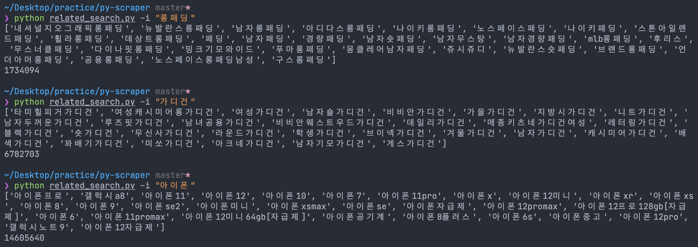

<h1 align="center">
    Python Web Scraper
</h1>

<p align="center">
    <a href="https://img.shields.io">
        </a>
    <a href="https://img.shields.io">
        </a>
    <a href="https://img.shields.io">
        </a>
    <a href="https://hits.seeyoufarm.com"></a>
</p>

<p align="center">
    
</p>

[이미지 출처](https://www.scrapingbee.com/blog/selenium-python/)

## 🚀 What is this

`bs4`와 `selenium`을 이용해서 만든 웹스크레퍼입니다.

1. [네이버 쇼핑몰](https://shopping.naver.com/)의 상세 페이지에서 리뷰들을 가져와 csv 파일로 추출할 수 있습니다.
2. 특정 item의 연관 검색어를 list로 추출할 수 있습니다.
3. 특정 item의 전체 검색 갯수를 int로 추출할 수 있습니다.
4. 네이버 검색에서의 카테고리별 추천 순서를 모바일/데스크톱 화면 기준으로 추출할 수 있습니다.
5. 네이버 검색에서의 섹션 순서를 모바일/데스크톱 화면 기준으로 추출할 수 있습니다.

### 리뷰 추출 데이터

> 평점, 판매 회사(구매한 곳), 리뷰 작성 날짜, 제목, 내용

## 🍿 Setup

```bash
# clone this project
$ cd py-scraper
$ pip install -r requirements.txt

# 설치 리스트
requests
Flask
beautifulsoup4
bs4
selenium
```

## 🔥 Run Program

```bash
# ~/your_work_space/py-scraper
$ python app.py -u {url} -l {limits of page} # 리뷰 크롤링
$ python related_search.py -i {search_item} # 연관 검색어
$ python naver_search.py -i {search_item} # 쇼핑 키워드 순서 추출
```

### ✔️ 예제

```bash
# 예제 2 페이지만 스크랩
$ python app.py -u "https://search.shopping.naver.com/catalog/15784793132?cat_id=50002334&nv_mid=15784793132&query=jbl+free+x" -l 2
# 예제 모든 페이지 스크랩 default 가 모든 페이지입니다.
$ python app.py -u "https://search.shopping.naver.com/catalog/15784793132?cat_id=50002334&nv_mid=15784793132&query=jbl+free+x"

# 인자 값 도움말
$ python app.py --help
```

### ✔️ 연관 검색어 예제

```bash
# 네이버 쇼핑에서 제공하는 롱패딩과 관련된 연관 검색어를 추출
$ python related_search.py -i "롱패딩"
# 네이버 쇼핑에서 제공하는 가디건과 관련된 연관 검색어를 추출
$ python related_search.py --item "가디건"
```

### ✔️ 쇼핑 키워드 예제

```bash
# 네이버 검색에서 데스크톱 / 모바일 기준으로 쇼핑 카테고리 + 섹션 순서를 추출
$ python naver_search.py --item "키보드"
$ python naver_search.py --item "아이폰"
$ python naver_search.py -i "물통"
```

### 📷 실행 화면


## 👀 result

### naver_review.csv

```csv
평점,만족도,날짜,제목,내용
1,1,18.10.08,리뷰제목,리뷰내용
1,1,18.10.08,리뷰제목,리뷰내용
1,1,18.10.08,리뷰제목,리뷰내용
1,1,18.10.08,리뷰제목,리뷰내용
...
```

### 연관 검색어



### 쇼핑 키워드


### 📷 리뷰 csv 파일


