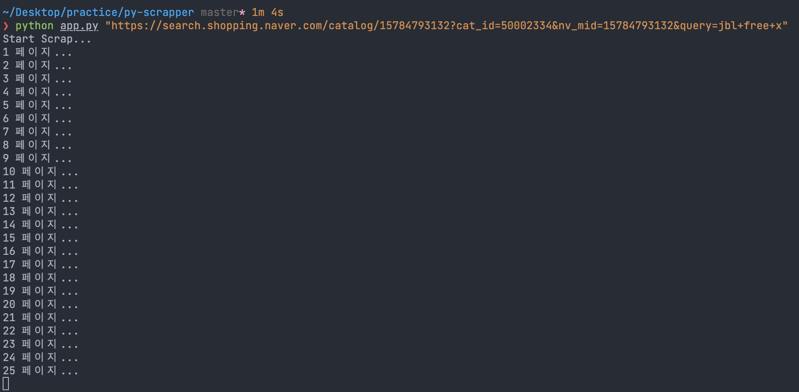
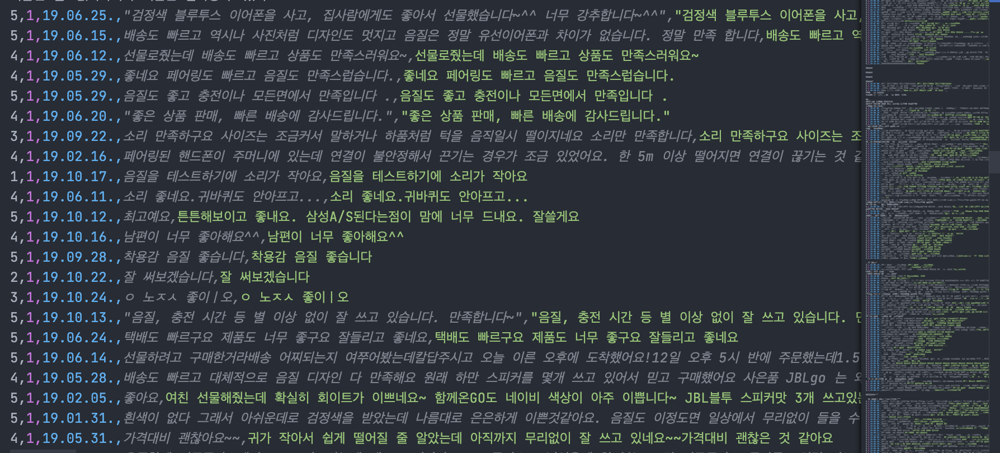

<h1 align="center">
    Python web scraper
</h1>

<p align="center">
    <a href="https://img.shields.io">
        </a>
    <a href="https://img.shields.io">
        </a>
    <a href="https://hits.seeyoufarm.com"></a>
</p>

## 🚀 What is this

`bs4`와 `selenium`을 이용해서 만든 웹스크레퍼입니다.  
[네이버 쇼핑몰](https://shopping.naver.com/)의 상세 페이지에서 리뷰들을 가져올 수 있습니다.

## 🍿 Setup

```bash
$ pip install -r requirements.txt

# 설치 리스트
requests
Flask
beautifulsoup4
bs4
selenium
```

## 🔥 Run Program

```bash
$ cd py-scraper
$ python app.py {url}

# 예제
$ python app.py "https://search.shopping.naver.com/catalog/15784793132?cat_id=50002334&nv_mid=15784793132&query=jbl+free+x"
```



## 👀 result

naver_review.csv

```csv
평점,만족도,날짜,제목,내용
1,1,18.10.08,리뷰제목,리뷰내용
1,1,18.10.08,리뷰제목,리뷰내용
1,1,18.10.08,리뷰제목,리뷰내용
1,1,18.10.08,리뷰제목,리뷰내용
...
```


